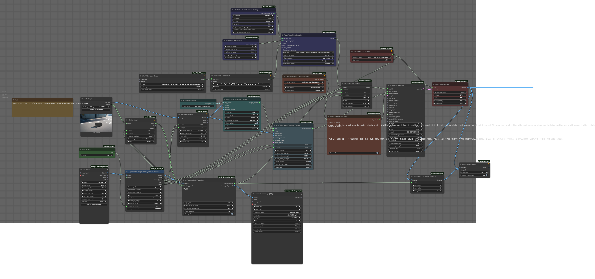

# Comfyui CoTracker Node

This is a node that outputs tracking results of a grid or specified points using CoTracker.  
It can be directly connected to the WanVideo ATI Tracks Node.  

 

<video controls height="300" src="images/sample4.mp4" muted="false"></video>

 

[Other examples can be found here.](example.md)

 

## Example Workflow
  

[workflow with perlin](images/workflow_perlin.png)  
[workflow with xyamp](images/workflow_xyamp.png)  

## Changelog
### 2025-6-4
1st commit

### 2025-6-6
added utility node
- PerlinCoordinateRandomizerNode  
Applies Perlin noise-based randomization to coordinate data, adding natural, smooth variations to tracking points across frames. 
- XYMotionAmplifierNode  
Amplifies coordinate movement with directional control for X/Y axes, preserving static points while enhancing motion intensity with optional mask-based selection.
- GridPointGeneratorNode  
Generates a grid of coordinate points.

### Related resources
- [CoTracker](https://github.com/facebookresearch/co-tracker)
- [ComfyUI-WanVideoWrapper](https://github.com/kijai/ComfyUI-WanVideoWrapper)
